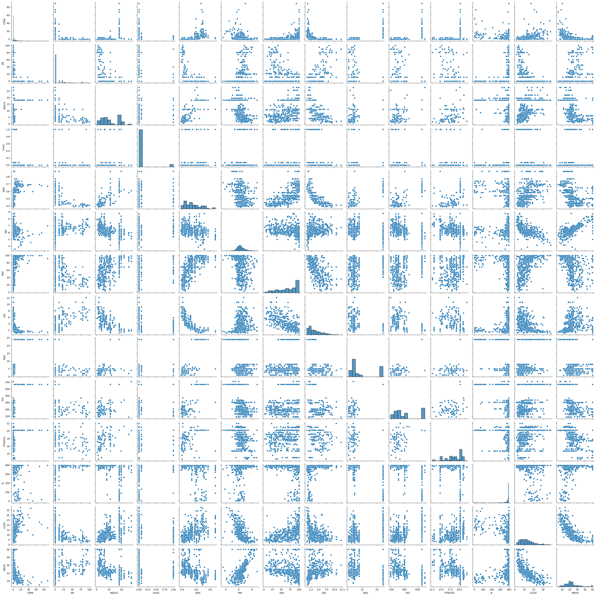

# Assignment 04
## Data Analytics I
### Create a Linear Regression Model using Python/R to predict home prices using Boston Housing Dataset (https://www.kaggle.com/c/boston-housing). The Boston Housing dataset contains information about various houses in Boston through different parameters. There are 506 samples and 14 feature variables in this dataset.
### The objective is to predict the value of prices of the house using the given features.


```python
import numpy as np
import pandas as pd
import seaborn as sns
import matplotlib.pyplot as plt
import warnings
```


```python
warnings.filterwarnings('ignore')
```


```python
df = pd.read_csv("HousingData.csv")
```

### Boston Dataset Description
1. CRIM - per capita crime rate by town
2. ZN - proportion of residential land zoned for lots over 25,000 sq.ft.
3. INDUS - proportion of non-retail business acres per town.
4. CHAS - Charles River dummy variable (1 if tract bounds river; 0 otherwise)
5. NOX - nitric oxides concentration (parts per 10 million)
6. RM - average number of rooms per dwelling
6. AGE - proportion of owner-occupied units built prior to 1940
7. DIS - weighted distances to five Boston employment centres
8. RAD - index of accessibility to radial highways
9. TAX - full-value property-tax rate per 10,000 doller
10. PTRATIO - pupil-teacher ratio by town
11. B - $1000(Bk - 0.63)^2$ where Bk is the proportion of blacks by town
12. LSTAT - \% lower status of the population
13. MEDV - Median value of owner-occupied homes in 1000's doller

### Five basic operations on the dataset


```python
df.shape
```


    (506, 14)


```python
df.head(10)
```


<div>
<style scoped>
    .dataframe tbody tr th:only-of-type {
        vertical-align: middle;
    }

    .dataframe tbody tr th {
        vertical-align: top;
    }

    .dataframe thead th {
        text-align: right;
    }
</style>
<table border="1" class="dataframe">
  <thead>
    <tr style="text-align: right;">
      <th></th>
      <th>CRIM</th>
      <th>ZN</th>
      <th>INDUS</th>
      <th>CHAS</th>
      <th>NOX</th>
      <th>RM</th>
      <th>AGE</th>
      <th>DIS</th>
      <th>RAD</th>
      <th>TAX</th>
      <th>PTRATIO</th>
      <th>B</th>
      <th>LSTAT</th>
      <th>MEDV</th>
    </tr>
  </thead>
  <tbody>
    <tr>
      <th>0</th>
      <td>0.00632</td>
      <td>18.0</td>
      <td>2.31</td>
      <td>0.0</td>
      <td>0.538</td>
      <td>6.575</td>
      <td>65.2</td>
      <td>4.0900</td>
      <td>1</td>
      <td>296</td>
      <td>15.3</td>
      <td>396.90</td>
      <td>4.98</td>
      <td>24.0</td>
    </tr>
    <tr>
      <th>1</th>
      <td>0.02731</td>
      <td>0.0</td>
      <td>7.07</td>
      <td>0.0</td>
      <td>0.469</td>
      <td>6.421</td>
      <td>78.9</td>
      <td>4.9671</td>
      <td>2</td>
      <td>242</td>
      <td>17.8</td>
      <td>396.90</td>
      <td>9.14</td>
      <td>21.6</td>
    </tr>
    <tr>
      <th>2</th>
      <td>0.02729</td>
      <td>0.0</td>
      <td>7.07</td>
      <td>0.0</td>
      <td>0.469</td>
      <td>7.185</td>
      <td>61.1</td>
      <td>4.9671</td>
      <td>2</td>
      <td>242</td>
      <td>17.8</td>
      <td>392.83</td>
      <td>4.03</td>
      <td>34.7</td>
    </tr>
    <tr>
      <th>3</th>
      <td>0.03237</td>
      <td>0.0</td>
      <td>2.18</td>
      <td>0.0</td>
      <td>0.458</td>
      <td>6.998</td>
      <td>45.8</td>
      <td>6.0622</td>
      <td>3</td>
      <td>222</td>
      <td>18.7</td>
      <td>394.63</td>
      <td>2.94</td>
      <td>33.4</td>
    </tr>
    <tr>
      <th>4</th>
      <td>0.06905</td>
      <td>0.0</td>
      <td>2.18</td>
      <td>0.0</td>
      <td>0.458</td>
      <td>7.147</td>
      <td>54.2</td>
      <td>6.0622</td>
      <td>3</td>
      <td>222</td>
      <td>18.7</td>
      <td>396.90</td>
      <td>NaN</td>
      <td>36.2</td>
    </tr>
    <tr>
      <th>5</th>
      <td>0.02985</td>
      <td>0.0</td>
      <td>2.18</td>
      <td>0.0</td>
      <td>0.458</td>
      <td>6.430</td>
      <td>58.7</td>
      <td>6.0622</td>
      <td>3</td>
      <td>222</td>
      <td>18.7</td>
      <td>394.12</td>
      <td>5.21</td>
      <td>28.7</td>
    </tr>
    <tr>
      <th>6</th>
      <td>0.08829</td>
      <td>12.5</td>
      <td>7.87</td>
      <td>NaN</td>
      <td>0.524</td>
      <td>6.012</td>
      <td>66.6</td>
      <td>5.5605</td>
      <td>5</td>
      <td>311</td>
      <td>15.2</td>
      <td>395.60</td>
      <td>12.43</td>
      <td>22.9</td>
    </tr>
    <tr>
      <th>7</th>
      <td>0.14455</td>
      <td>12.5</td>
      <td>7.87</td>
      <td>0.0</td>
      <td>0.524</td>
      <td>6.172</td>
      <td>96.1</td>
      <td>5.9505</td>
      <td>5</td>
      <td>311</td>
      <td>15.2</td>
      <td>396.90</td>
      <td>19.15</td>
      <td>27.1</td>
    </tr>
    <tr>
      <th>8</th>
      <td>0.21124</td>
      <td>12.5</td>
      <td>7.87</td>
      <td>0.0</td>
      <td>0.524</td>
      <td>5.631</td>
      <td>100.0</td>
      <td>6.0821</td>
      <td>5</td>
      <td>311</td>
      <td>15.2</td>
      <td>386.63</td>
      <td>29.93</td>
      <td>16.5</td>
    </tr>
    <tr>
      <th>9</th>
      <td>0.17004</td>
      <td>12.5</td>
      <td>7.87</td>
      <td>NaN</td>
      <td>0.524</td>
      <td>6.004</td>
      <td>85.9</td>
      <td>6.5921</td>
      <td>5</td>
      <td>311</td>
      <td>15.2</td>
      <td>386.71</td>
      <td>17.10</td>
      <td>18.9</td>
    </tr>
  </tbody>
</table>
</div>


```python
df.describe()
```


<div>
<style scoped>
    .dataframe tbody tr th:only-of-type {
        vertical-align: middle;
    }

    .dataframe tbody tr th {
        vertical-align: top;
    }

    .dataframe thead th {
        text-align: right;
    }
</style>
<table border="1" class="dataframe">
  <thead>
    <tr style="text-align: right;">
      <th></th>
      <th>CRIM</th>
      <th>ZN</th>
      <th>INDUS</th>
      <th>CHAS</th>
      <th>NOX</th>
      <th>RM</th>
      <th>AGE</th>
      <th>DIS</th>
      <th>RAD</th>
      <th>TAX</th>
      <th>PTRATIO</th>
      <th>B</th>
      <th>LSTAT</th>
      <th>MEDV</th>
    </tr>
  </thead>
  <tbody>
    <tr>
      <th>count</th>
      <td>486.000000</td>
      <td>486.000000</td>
      <td>486.000000</td>
      <td>486.000000</td>
      <td>506.000000</td>
      <td>506.000000</td>
      <td>486.000000</td>
      <td>506.000000</td>
      <td>506.000000</td>
      <td>506.000000</td>
      <td>506.000000</td>
      <td>506.000000</td>
      <td>486.000000</td>
      <td>506.000000</td>
    </tr>
    <tr>
      <th>mean</th>
      <td>3.611874</td>
      <td>11.211934</td>
      <td>11.083992</td>
      <td>0.069959</td>
      <td>0.554695</td>
      <td>6.284634</td>
      <td>68.518519</td>
      <td>3.795043</td>
      <td>9.549407</td>
      <td>408.237154</td>
      <td>18.455534</td>
      <td>356.674032</td>
      <td>12.715432</td>
      <td>22.532806</td>
    </tr>
    <tr>
      <th>std</th>
      <td>8.720192</td>
      <td>23.388876</td>
      <td>6.835896</td>
      <td>0.255340</td>
      <td>0.115878</td>
      <td>0.702617</td>
      <td>27.999513</td>
      <td>2.105710</td>
      <td>8.707259</td>
      <td>168.537116</td>
      <td>2.164946</td>
      <td>91.294864</td>
      <td>7.155871</td>
      <td>9.197104</td>
    </tr>
    <tr>
      <th>min</th>
      <td>0.006320</td>
      <td>0.000000</td>
      <td>0.460000</td>
      <td>0.000000</td>
      <td>0.385000</td>
      <td>3.561000</td>
      <td>2.900000</td>
      <td>1.129600</td>
      <td>1.000000</td>
      <td>187.000000</td>
      <td>12.600000</td>
      <td>0.320000</td>
      <td>1.730000</td>
      <td>5.000000</td>
    </tr>
    <tr>
      <th>25%</th>
      <td>0.081900</td>
      <td>0.000000</td>
      <td>5.190000</td>
      <td>0.000000</td>
      <td>0.449000</td>
      <td>5.885500</td>
      <td>45.175000</td>
      <td>2.100175</td>
      <td>4.000000</td>
      <td>279.000000</td>
      <td>17.400000</td>
      <td>375.377500</td>
      <td>7.125000</td>
      <td>17.025000</td>
    </tr>
    <tr>
      <th>50%</th>
      <td>0.253715</td>
      <td>0.000000</td>
      <td>9.690000</td>
      <td>0.000000</td>
      <td>0.538000</td>
      <td>6.208500</td>
      <td>76.800000</td>
      <td>3.207450</td>
      <td>5.000000</td>
      <td>330.000000</td>
      <td>19.050000</td>
      <td>391.440000</td>
      <td>11.430000</td>
      <td>21.200000</td>
    </tr>
    <tr>
      <th>75%</th>
      <td>3.560263</td>
      <td>12.500000</td>
      <td>18.100000</td>
      <td>0.000000</td>
      <td>0.624000</td>
      <td>6.623500</td>
      <td>93.975000</td>
      <td>5.188425</td>
      <td>24.000000</td>
      <td>666.000000</td>
      <td>20.200000</td>
      <td>396.225000</td>
      <td>16.955000</td>
      <td>25.000000</td>
    </tr>
    <tr>
      <th>max</th>
      <td>88.976200</td>
      <td>100.000000</td>
      <td>27.740000</td>
      <td>1.000000</td>
      <td>0.871000</td>
      <td>8.780000</td>
      <td>100.000000</td>
      <td>12.126500</td>
      <td>24.000000</td>
      <td>711.000000</td>
      <td>22.000000</td>
      <td>396.900000</td>
      <td>37.970000</td>
      <td>50.000000</td>
    </tr>
  </tbody>
</table>
</div>


```python
df.info()
```

    <class 'pandas.core.frame.DataFrame'>
    RangeIndex: 506 entries, 0 to 505
    Data columns (total 14 columns):
     #   Column   Non-Null Count  Dtype  
    ---  ------   --------------  -----  
     0   CRIM     486 non-null    float64
     1   ZN       486 non-null    float64
     2   INDUS    486 non-null    float64
     3   CHAS     486 non-null    float64
     4   NOX      506 non-null    float64
     5   RM       506 non-null    float64
     6   AGE      486 non-null    float64
     7   DIS      506 non-null    float64
     8   RAD      506 non-null    int64  
     9   TAX      506 non-null    int64  
     10  PTRATIO  506 non-null    float64
     11  B        506 non-null    float64
     12  LSTAT    486 non-null    float64
     13  MEDV     506 non-null    float64
    dtypes: float64(12), int64(2)
    memory usage: 55.5 KB


```python
df.isnull().sum()
```


    CRIM       20
    ZN         20
    INDUS      20
    CHAS       20
    NOX         0
    RM          0
    AGE        20
    DIS         0
    RAD         0
    TAX         0
    PTRATIO     0
    B           0
    LSTAT      20
    MEDV        0
    dtype: int64


### Treating Null values


```python
df.fillna(df.mean(), inplace=True)
```


```python
df.isnull().sum()
```


    CRIM       0
    ZN         0
    INDUS      0
    CHAS       0
    NOX        0
    RM         0
    AGE        0
    DIS        0
    RAD        0
    TAX        0
    PTRATIO    0
    B          0
    LSTAT      0
    MEDV       0
    dtype: int64


```python
df.corr()
```


<div>
<style scoped>
    .dataframe tbody tr th:only-of-type {
        vertical-align: middle;
    }

    .dataframe tbody tr th {
        vertical-align: top;
    }

    .dataframe thead th {
        text-align: right;
    }
</style>
<table border="1" class="dataframe">
  <thead>
    <tr style="text-align: right;">
      <th></th>
      <th>CRIM</th>
      <th>ZN</th>
      <th>INDUS</th>
      <th>CHAS</th>
      <th>NOX</th>
      <th>RM</th>
      <th>AGE</th>
      <th>DIS</th>
      <th>RAD</th>
      <th>TAX</th>
      <th>PTRATIO</th>
      <th>B</th>
      <th>LSTAT</th>
      <th>MEDV</th>
    </tr>
  </thead>
  <tbody>
    <tr>
      <th>CRIM</th>
      <td>1.000000</td>
      <td>-0.182930</td>
      <td>0.391161</td>
      <td>-0.052223</td>
      <td>0.410377</td>
      <td>-0.215434</td>
      <td>0.344934</td>
      <td>-0.366523</td>
      <td>0.608886</td>
      <td>0.566528</td>
      <td>0.273384</td>
      <td>-0.370163</td>
      <td>0.434044</td>
      <td>-0.379695</td>
    </tr>
    <tr>
      <th>ZN</th>
      <td>-0.182930</td>
      <td>1.000000</td>
      <td>-0.513336</td>
      <td>-0.036147</td>
      <td>-0.502287</td>
      <td>0.316550</td>
      <td>-0.541274</td>
      <td>0.638388</td>
      <td>-0.306316</td>
      <td>-0.308334</td>
      <td>-0.403085</td>
      <td>0.167431</td>
      <td>-0.407549</td>
      <td>0.365943</td>
    </tr>
    <tr>
      <th>INDUS</th>
      <td>0.391161</td>
      <td>-0.513336</td>
      <td>1.000000</td>
      <td>0.058035</td>
      <td>0.740965</td>
      <td>-0.381457</td>
      <td>0.614592</td>
      <td>-0.699639</td>
      <td>0.593176</td>
      <td>0.716062</td>
      <td>0.384806</td>
      <td>-0.354597</td>
      <td>0.567354</td>
      <td>-0.478657</td>
    </tr>
    <tr>
      <th>CHAS</th>
      <td>-0.052223</td>
      <td>-0.036147</td>
      <td>0.058035</td>
      <td>1.000000</td>
      <td>0.073286</td>
      <td>0.102284</td>
      <td>0.075206</td>
      <td>-0.091680</td>
      <td>0.001425</td>
      <td>-0.031483</td>
      <td>-0.109310</td>
      <td>0.050055</td>
      <td>-0.046166</td>
      <td>0.179882</td>
    </tr>
    <tr>
      <th>NOX</th>
      <td>0.410377</td>
      <td>-0.502287</td>
      <td>0.740965</td>
      <td>0.073286</td>
      <td>1.000000</td>
      <td>-0.302188</td>
      <td>0.711461</td>
      <td>-0.769230</td>
      <td>0.611441</td>
      <td>0.668023</td>
      <td>0.188933</td>
      <td>-0.380051</td>
      <td>0.572379</td>
      <td>-0.427321</td>
    </tr>
    <tr>
      <th>RM</th>
      <td>-0.215434</td>
      <td>0.316550</td>
      <td>-0.381457</td>
      <td>0.102284</td>
      <td>-0.302188</td>
      <td>1.000000</td>
      <td>-0.241351</td>
      <td>0.205246</td>
      <td>-0.209847</td>
      <td>-0.292048</td>
      <td>-0.355501</td>
      <td>0.128069</td>
      <td>-0.602962</td>
      <td>0.695360</td>
    </tr>
    <tr>
      <th>AGE</th>
      <td>0.344934</td>
      <td>-0.541274</td>
      <td>0.614592</td>
      <td>0.075206</td>
      <td>0.711461</td>
      <td>-0.241351</td>
      <td>1.000000</td>
      <td>-0.724353</td>
      <td>0.449989</td>
      <td>0.500589</td>
      <td>0.262723</td>
      <td>-0.265282</td>
      <td>0.574893</td>
      <td>-0.380223</td>
    </tr>
    <tr>
      <th>DIS</th>
      <td>-0.366523</td>
      <td>0.638388</td>
      <td>-0.699639</td>
      <td>-0.091680</td>
      <td>-0.769230</td>
      <td>0.205246</td>
      <td>-0.724353</td>
      <td>1.000000</td>
      <td>-0.494588</td>
      <td>-0.534432</td>
      <td>-0.232471</td>
      <td>0.291512</td>
      <td>-0.483429</td>
      <td>0.249929</td>
    </tr>
    <tr>
      <th>RAD</th>
      <td>0.608886</td>
      <td>-0.306316</td>
      <td>0.593176</td>
      <td>0.001425</td>
      <td>0.611441</td>
      <td>-0.209847</td>
      <td>0.449989</td>
      <td>-0.494588</td>
      <td>1.000000</td>
      <td>0.910228</td>
      <td>0.464741</td>
      <td>-0.444413</td>
      <td>0.468440</td>
      <td>-0.381626</td>
    </tr>
    <tr>
      <th>TAX</th>
      <td>0.566528</td>
      <td>-0.308334</td>
      <td>0.716062</td>
      <td>-0.031483</td>
      <td>0.668023</td>
      <td>-0.292048</td>
      <td>0.500589</td>
      <td>-0.534432</td>
      <td>0.910228</td>
      <td>1.000000</td>
      <td>0.460853</td>
      <td>-0.441808</td>
      <td>0.524545</td>
      <td>-0.468536</td>
    </tr>
    <tr>
      <th>PTRATIO</th>
      <td>0.273384</td>
      <td>-0.403085</td>
      <td>0.384806</td>
      <td>-0.109310</td>
      <td>0.188933</td>
      <td>-0.355501</td>
      <td>0.262723</td>
      <td>-0.232471</td>
      <td>0.464741</td>
      <td>0.460853</td>
      <td>1.000000</td>
      <td>-0.177383</td>
      <td>0.373343</td>
      <td>-0.507787</td>
    </tr>
    <tr>
      <th>B</th>
      <td>-0.370163</td>
      <td>0.167431</td>
      <td>-0.354597</td>
      <td>0.050055</td>
      <td>-0.380051</td>
      <td>0.128069</td>
      <td>-0.265282</td>
      <td>0.291512</td>
      <td>-0.444413</td>
      <td>-0.441808</td>
      <td>-0.177383</td>
      <td>1.000000</td>
      <td>-0.368886</td>
      <td>0.333461</td>
    </tr>
    <tr>
      <th>LSTAT</th>
      <td>0.434044</td>
      <td>-0.407549</td>
      <td>0.567354</td>
      <td>-0.046166</td>
      <td>0.572379</td>
      <td>-0.602962</td>
      <td>0.574893</td>
      <td>-0.483429</td>
      <td>0.468440</td>
      <td>0.524545</td>
      <td>0.373343</td>
      <td>-0.368886</td>
      <td>1.000000</td>
      <td>-0.721975</td>
    </tr>
    <tr>
      <th>MEDV</th>
      <td>-0.379695</td>
      <td>0.365943</td>
      <td>-0.478657</td>
      <td>0.179882</td>
      <td>-0.427321</td>
      <td>0.695360</td>
      <td>-0.380223</td>
      <td>0.249929</td>
      <td>-0.381626</td>
      <td>-0.468536</td>
      <td>-0.507787</td>
      <td>0.333461</td>
      <td>-0.721975</td>
      <td>1.000000</td>
    </tr>
  </tbody>
</table>
</div>


```python
plt.figure(figsize = (12, 10))
sns.heatmap(df.corr(), annot = True)
```


    <Axes: >


    

    


```python
sns.pairplot(df)
plt.show()
```


    

    


```python
sns.histplot(df['RM'])
plt.show()
```


    

    


```python
sns.histplot(df['PTRATIO'])
plt.show()
```


    

    


```python
sns.histplot(df['LSTAT'])
plt.show()
```


    

    


```python
plt.figure(figsize = (12, 10))
sns.boxplot(df)
plt.show()
```


    

    


```python
# Defininig function for Outliers Treatement

def Outlier_Treatment(col):
    Q1 = df[col].quantile(0.25)
    Q3 = df[col].quantile(0.75)
    IQR = Q3 - Q1
    upper = Q3 + (1.5 * IQR)
    lower = Q1 - (1.5 * IQR)
    np.clip(df[col], lower, upper, inplace = True)
```


```python
outlier_list = ['CRIM', 'ZN', 'CHAS', 'RM', 'DIS', 'PTRATIO', 'B', 'LSTAT', 'MEDV']

for i in outlier_list:
    Outlier_Treatment(i)
```


```python
plt.figure(figsize = (12, 10))
sns.boxplot(df)
plt.show()
```


    

    


```python
X = df.iloc[: , : -1]
Y = df.iloc[: , -1]
```


```python
X       # Test Data set
```


<div>
<style scoped>
    .dataframe tbody tr th:only-of-type {
        vertical-align: middle;
    }

    .dataframe tbody tr th {
        vertical-align: top;
    }

    .dataframe thead th {
        text-align: right;
    }
</style>
<table border="1" class="dataframe">
  <thead>
    <tr style="text-align: right;">
      <th></th>
      <th>CRIM</th>
      <th>ZN</th>
      <th>INDUS</th>
      <th>CHAS</th>
      <th>NOX</th>
      <th>RM</th>
      <th>AGE</th>
      <th>DIS</th>
      <th>RAD</th>
      <th>TAX</th>
      <th>PTRATIO</th>
      <th>B</th>
      <th>LSTAT</th>
    </tr>
  </thead>
  <tbody>
    <tr>
      <th>0</th>
      <td>0.00632</td>
      <td>18.0</td>
      <td>2.31</td>
      <td>0.0</td>
      <td>0.538</td>
      <td>6.575</td>
      <td>65.200000</td>
      <td>4.0900</td>
      <td>1</td>
      <td>296</td>
      <td>15.3</td>
      <td>396.90</td>
      <td>4.980000</td>
    </tr>
    <tr>
      <th>1</th>
      <td>0.02731</td>
      <td>0.0</td>
      <td>7.07</td>
      <td>0.0</td>
      <td>0.469</td>
      <td>6.421</td>
      <td>78.900000</td>
      <td>4.9671</td>
      <td>2</td>
      <td>242</td>
      <td>17.8</td>
      <td>396.90</td>
      <td>9.140000</td>
    </tr>
    <tr>
      <th>2</th>
      <td>0.02729</td>
      <td>0.0</td>
      <td>7.07</td>
      <td>0.0</td>
      <td>0.469</td>
      <td>7.185</td>
      <td>61.100000</td>
      <td>4.9671</td>
      <td>2</td>
      <td>242</td>
      <td>17.8</td>
      <td>392.83</td>
      <td>4.030000</td>
    </tr>
    <tr>
      <th>3</th>
      <td>0.03237</td>
      <td>0.0</td>
      <td>2.18</td>
      <td>0.0</td>
      <td>0.458</td>
      <td>6.998</td>
      <td>45.800000</td>
      <td>6.0622</td>
      <td>3</td>
      <td>222</td>
      <td>18.7</td>
      <td>394.63</td>
      <td>2.940000</td>
    </tr>
    <tr>
      <th>4</th>
      <td>0.06905</td>
      <td>0.0</td>
      <td>2.18</td>
      <td>0.0</td>
      <td>0.458</td>
      <td>7.147</td>
      <td>54.200000</td>
      <td>6.0622</td>
      <td>3</td>
      <td>222</td>
      <td>18.7</td>
      <td>396.90</td>
      <td>12.715432</td>
    </tr>
    <tr>
      <th>...</th>
      <td>...</td>
      <td>...</td>
      <td>...</td>
      <td>...</td>
      <td>...</td>
      <td>...</td>
      <td>...</td>
      <td>...</td>
      <td>...</td>
      <td>...</td>
      <td>...</td>
      <td>...</td>
      <td>...</td>
    </tr>
    <tr>
      <th>501</th>
      <td>0.06263</td>
      <td>0.0</td>
      <td>11.93</td>
      <td>0.0</td>
      <td>0.573</td>
      <td>6.593</td>
      <td>69.100000</td>
      <td>2.4786</td>
      <td>1</td>
      <td>273</td>
      <td>21.0</td>
      <td>391.99</td>
      <td>12.715432</td>
    </tr>
    <tr>
      <th>502</th>
      <td>0.04527</td>
      <td>0.0</td>
      <td>11.93</td>
      <td>0.0</td>
      <td>0.573</td>
      <td>6.120</td>
      <td>76.700000</td>
      <td>2.2875</td>
      <td>1</td>
      <td>273</td>
      <td>21.0</td>
      <td>396.90</td>
      <td>9.080000</td>
    </tr>
    <tr>
      <th>503</th>
      <td>0.06076</td>
      <td>0.0</td>
      <td>11.93</td>
      <td>0.0</td>
      <td>0.573</td>
      <td>6.976</td>
      <td>91.000000</td>
      <td>2.1675</td>
      <td>1</td>
      <td>273</td>
      <td>21.0</td>
      <td>396.90</td>
      <td>5.640000</td>
    </tr>
    <tr>
      <th>504</th>
      <td>0.10959</td>
      <td>0.0</td>
      <td>11.93</td>
      <td>0.0</td>
      <td>0.573</td>
      <td>6.794</td>
      <td>89.300000</td>
      <td>2.3889</td>
      <td>1</td>
      <td>273</td>
      <td>21.0</td>
      <td>393.45</td>
      <td>6.480000</td>
    </tr>
    <tr>
      <th>505</th>
      <td>0.04741</td>
      <td>0.0</td>
      <td>11.93</td>
      <td>0.0</td>
      <td>0.573</td>
      <td>6.030</td>
      <td>68.518519</td>
      <td>2.5050</td>
      <td>1</td>
      <td>273</td>
      <td>21.0</td>
      <td>396.90</td>
      <td>7.880000</td>
    </tr>
  </tbody>
</table>
<p>506 rows × 13 columns</p>
</div>


```python
Y         # Train Data set
```


    0      24.0
    1      21.6
    2      34.7
    3      33.4
    4      36.2
           ... 
    501    22.4
    502    20.6
    503    23.9
    504    22.0
    505    11.9
    Name: MEDV, Length: 506, dtype: float64


### Second step: spliting dataset into train and test set


```python
from sklearn.model_selection import train_test_split
```


```python
X_train, X_test, Y_train, Y_test = train_test_split(X, Y, test_size = 0.20, random_state = 42)
```


```python
X_train.shape
```


    (404, 13)


```python
X_test.shape
```


    (102, 13)


```python
Y_train.shape
```


    (404,)


```python
Y_test.shape
```


    (102,)


### Third step: Create regressor object


```python
from sklearn.linear_model import LinearRegression
```


```python
lr = LinearRegression()
```

### Forth step: Train the model


```python
lr.fit(X_train, Y_train)
```


<style>#sk-container-id-1 {color: black;background-color: white;}#sk-container-id-1 pre{padding: 0;}#sk-container-id-1 div.sk-toggleable {background-color: white;}#sk-container-id-1 label.sk-toggleable__label {cursor: pointer;display: block;width: 100%;margin-bottom: 0;padding: 0.3em;box-sizing: border-box;text-align: center;}#sk-container-id-1 label.sk-toggleable__label-arrow:before {content: "▸";float: left;margin-right: 0.25em;color: #696969;}#sk-container-id-1 label.sk-toggleable__label-arrow:hover:before {color: black;}#sk-container-id-1 div.sk-estimator:hover label.sk-toggleable__label-arrow:before {color: black;}#sk-container-id-1 div.sk-toggleable__content {max-height: 0;max-width: 0;overflow: hidden;text-align: left;background-color: #f0f8ff;}#sk-container-id-1 div.sk-toggleable__content pre {margin: 0.2em;color: black;border-radius: 0.25em;background-color: #f0f8ff;}#sk-container-id-1 input.sk-toggleable__control:checked~div.sk-toggleable__content {max-height: 200px;max-width: 100%;overflow: auto;}#sk-container-id-1 input.sk-toggleable__control:checked~label.sk-toggleable__label-arrow:before {content: "▾";}#sk-container-id-1 div.sk-estimator input.sk-toggleable__control:checked~label.sk-toggleable__label {background-color: #d4ebff;}#sk-container-id-1 div.sk-label input.sk-toggleable__control:checked~label.sk-toggleable__label {background-color: #d4ebff;}#sk-container-id-1 input.sk-hidden--visually {border: 0;clip: rect(1px 1px 1px 1px);clip: rect(1px, 1px, 1px, 1px);height: 1px;margin: -1px;overflow: hidden;padding: 0;position: absolute;width: 1px;}#sk-container-id-1 div.sk-estimator {font-family: monospace;background-color: #f0f8ff;border: 1px dotted black;border-radius: 0.25em;box-sizing: border-box;margin-bottom: 0.5em;}#sk-container-id-1 div.sk-estimator:hover {background-color: #d4ebff;}#sk-container-id-1 div.sk-parallel-item::after {content: "";width: 100%;border-bottom: 1px solid gray;flex-grow: 1;}#sk-container-id-1 div.sk-label:hover label.sk-toggleable__label {background-color: #d4ebff;}#sk-container-id-1 div.sk-serial::before {content: "";position: absolute;border-left: 1px solid gray;box-sizing: border-box;top: 0;bottom: 0;left: 50%;z-index: 0;}#sk-container-id-1 div.sk-serial {display: flex;flex-direction: column;align-items: center;background-color: white;padding-right: 0.2em;padding-left: 0.2em;position: relative;}#sk-container-id-1 div.sk-item {position: relative;z-index: 1;}#sk-container-id-1 div.sk-parallel {display: flex;align-items: stretch;justify-content: center;background-color: white;position: relative;}#sk-container-id-1 div.sk-item::before, #sk-container-id-1 div.sk-parallel-item::before {content: "";position: absolute;border-left: 1px solid gray;box-sizing: border-box;top: 0;bottom: 0;left: 50%;z-index: -1;}#sk-container-id-1 div.sk-parallel-item {display: flex;flex-direction: column;z-index: 1;position: relative;background-color: white;}#sk-container-id-1 div.sk-parallel-item:first-child::after {align-self: flex-end;width: 50%;}#sk-container-id-1 div.sk-parallel-item:last-child::after {align-self: flex-start;width: 50%;}#sk-container-id-1 div.sk-parallel-item:only-child::after {width: 0;}#sk-container-id-1 div.sk-dashed-wrapped {border: 1px dashed gray;margin: 0 0.4em 0.5em 0.4em;box-sizing: border-box;padding-bottom: 0.4em;background-color: white;}#sk-container-id-1 div.sk-label label {font-family: monospace;font-weight: bold;display: inline-block;line-height: 1.2em;}#sk-container-id-1 div.sk-label-container {text-align: center;}#sk-container-id-1 div.sk-container {/* jupyter's `normalize.less` sets `[hidden] { display: none; }` but bootstrap.min.css set `[hidden] { display: none !important; }` so we also need the `!important` here to be able to override the default hidden behavior on the sphinx rendered scikit-learn.org. See: https://github.com/scikit-learn/scikit-learn/issues/21755 */display: inline-block !important;position: relative;}#sk-container-id-1 div.sk-text-repr-fallback {display: none;}</style><div id="sk-container-id-1" class="sk-top-container"><div class="sk-text-repr-fallback"><pre>LinearRegression()</pre><b>In a Jupyter environment, please rerun this cell to show the HTML representation or trust the notebook. <br />On GitHub, the HTML representation is unable to render, please try loading this page with nbviewer.org.</b></div><div class="sk-container" hidden><div class="sk-item"><div class="sk-estimator sk-toggleable"><input class="sk-toggleable__control sk-hidden--visually" id="sk-estimator-id-1" type="checkbox" checked><label for="sk-estimator-id-1" class="sk-toggleable__label sk-toggleable__label-arrow">LinearRegression</label><div class="sk-toggleable__content"><pre>LinearRegression()</pre></div></div></div></div></div>


### Fifth step: Test Model


```python
Y_predict = lr.predict(X_test)
```


```python
Y_predict
```


    array([28.12998352, 32.10368184, 14.55309695, 25.04450083, 17.36834295,
           22.47783932, 18.48063506, 14.38080495, 20.93324639, 21.00755837,
           21.58352826, 19.52897434,  4.21280532, 21.67346416, 19.70855659,
           23.28960959, 18.92435647,  5.09453434, 37.28797702, 14.72489187,
           24.822214  , 29.45847685, 12.24594521, 22.29414305, 15.64519144,
           12.91138319, 21.27011722, 15.39166991, 19.9539713 , 19.93087162,
           22.67307075, 25.10339773, 22.9164474 , 17.15615236, 15.40883606,
           17.36987681, 29.94799031, 21.20309529, 21.06063996, 22.40405441,
           15.50365852, 31.37401179, 37.82263965, 18.89781951, 26.91060329,
           14.97975693, 14.46833264, 25.74512565, 18.78138415, 29.80576142,
           21.86085851, 32.92945816, 16.41559595, 25.65915759, 37.64010366,
           21.42778718, 17.20058057, 30.74449282, 25.17628252, 14.65056706,
           23.71273009, 29.22000523, 29.12654849, 17.43752536, 22.24935483,
           14.55468619, 17.08222345, 26.41627079, 29.44884344, 14.77823159,
           21.31643861, 24.13643114, 10.34215783, 16.24571863, 23.43595811,
            7.83921219, 21.48477471, 37.43453505, 16.150102  ,  9.23778241,
           21.87741367, 11.27202686, 21.1661152 ,  8.01394877, 22.74730628,
           28.07619251, 19.07922969, 25.45253543, 28.20722048, 19.17090162,
           25.93375895,  8.21698823, 18.79714578, 16.64490561, 16.67997941,
           19.51165035, 20.1217181 ,  5.4186735 , 14.96684522, 16.39367986,
           22.86714676, 24.00532769])


### Sixth step: evaluate the model


```python
from sklearn.metrics import mean_squared_error, mean_absolute_error
```


```python
mean_squared_error(Y_test, Y_predict)
```


    12.530761843608529


```python
mean_absolute_error(Y_test, Y_predict)
```


    2.414845584010699


```python
np.sqrt(mean_squared_error(Y_test, Y_predict))
```


    3.5398816143493455


```python

```
